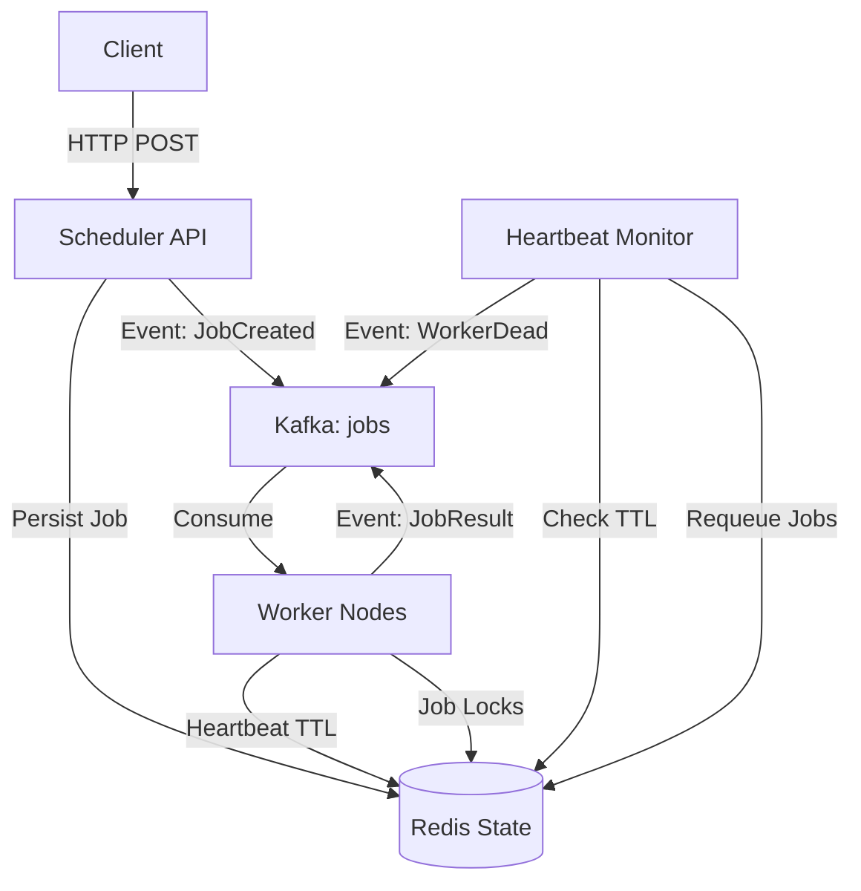

# Distributed Job Scheduler (At Scale)
PS (Currently trying to build watchdog timer and also containerization for realtime scalability)


> **Summary:** A Kafka-driven, fault-tolerant distributed job scheduler featuring leader-based scheduling, worker heartbeats with TTL, distributed locking, idempotent event processing, and Redis-backed state management.

## 1. Project Overview

This system is designed to execute tasks across multiple worker nodes reliably, handling failures and scaling horizontally. It moves jobs through a strict lifecycle:
`PENDING` → `RUNNING` → `SUCCESS` | `FAILED`

### Core Features
* **Distributed Architecture:** Decoupled Scheduler, API, and Workers using Kafka.
* **Fault Tolerance:** Automatic recovery from worker crashes via heartbeat TTL monitoring.
* **At-Least-Once Delivery:** Ensures tasks are never lost, even during network partitions.
* **Leader Election:** Ensures only one Heartbeat Monitor instance detects dead workers.
* **Distributed Locking:** Redis-based job locks prevent duplicate processing.
* **Idempotency:** Workers safely handle duplicate Kafka events via tracking.
* **Graceful Shutdown:** Workers requeue in-flight jobs on shutdown.
* **Hybrid Communication:** HTTP (FastAPI) for external clients, gRPC/Kafka for internal high-performance signaling.

---

## 2. System Architecture

The system uses a **Producer-Consumer** pattern with **Redis** as the single source of truth for job state.



### Component Breakdown

| Component | Responsibility |
| :--- | :--- |
| **Scheduler API** | Accepts jobs via HTTP, validates input, persists initial state to Redis, and publishes `JobCreated` events. |
| **Workers** | Consume jobs from Kafka, execute tasks, send heartbeats with TTL, and report results. |
| **Heartbeat Monitor** | Detects dead workers (expired heartbeats), requeues orphaned jobs, supports leader election for HA. |
| **Redis** | Authoritative state for Job Lifecycle, Worker Heartbeats (with TTL), Distributed Locks, and Idempotency Keys. |
| **Kafka** | Event backbone ensures decoupling and replayability. |

---

## 3. Heartbeat TTL & Crash Recovery

The system uses **Redis TTL** for automatic dead worker detection:

```
┌─────────────┐     SETEX (15s TTL)      ┌─────────────┐
│   Worker    │ ────────────────────────▶│    Redis    │
│  (every 5s) │                          │  Heartbeat  │
└─────────────┘                          └──────┬──────┘
                                                │
                                         TTL Expires
                                                │
                                                ▼
                                    ┌─────────────────────┐
                                    │  Heartbeat Monitor  │
                                    │  - Detect dead      │
                                    │  - Requeue jobs     │
                                    │  - Emit WorkerDead  │
                                    └─────────────────────┘
```

### Configuration

| Setting | Default | Description |
|---------|---------|-------------|
| `WORKER_HEARTBEAT_TTL` | 15s | Heartbeat auto-expires in Redis |
| `HEARTBEAT_INTERVAL` | 5s | How often workers send heartbeats |
| `JOB_LOCK_TTL` | 60s | Distributed lock duration for job processing |
| `STALE_JOB_TIMEOUT` | 300s | Jobs running longer are recovered |
| `IDEMPOTENCY_TTL` | 24h | How long to remember processed events |

---

## 4. Data Models

### Job Schema
Stored in Redis and passed via API.
```json
{
  "job_id": "job_1234567890",
  "payload": {
    "task": "image_resize",
    "image_url": "s3://bucket/image.png"
  },
  "status": "PENDING",
  "assigned_worker": "worker-node-01",
  "retry_count": 0,
  "max_retries": 3,
  "version": 0,
  "processing_token": "uuid-for-idempotency",
  "timestamps": {
    "created_at": "2025-12-31T10:00:00Z",
    "assigned_at": "2025-12-31T10:00:01Z",
    "started_at": "2025-12-31T10:00:02Z",
    "completed_at": "2025-12-31T10:00:05Z"
  }
}
```

### Worker Heartbeat Schema
Stored with TTL for automatic expiration.

```json
{
  "worker_id": "worker-node-01",
  "last_seen": "2025-12-31T10:05:00Z",
  "status": "alive"
}
```
**Redis Key:** `worker:{worker_id}:heartbeat` with **15 second TTL**

### Kafka Events
The system relies on strict event types for communication:

* `JobCreated`: Triggered when a client submits a request.
* `JobStarted`: Worker acquires lock and begins processing.
* `JobCompleted`: Worker finishes successfully.
* `JobFailed`: Execution error or timeout.
* `JobRequeued`: Job reassigned after worker crash.
* `JobCanceled`: Job canceled by user.
* `WorkerDead`: Worker heartbeat TTL expired.

---

## 5. Setup & Installation

### Prerequisites
* Python 3.9+
* Docker & Docker Compose

### Step 1: Generate gRPC Code
Compile the Protocol Buffer definitions for internal communication.

```bash
python -m grpc_tools.protoc \
  -I . \
  --python_out=. \
  --grpc_python_out=. \
  internal/proto/scheduler.proto
```

### Step 2: Start Infrastructure (Docker)
Start Redis, Zookeeper, and Kafka.
```

### Step 2: Start Infrastructure (Docker)
Start Redis, Zookeeper, and Kafka.

```bash
# 1. Start Zookeeper
```bash
# 1. Start Zookeeper
docker run -d --name zookeeper -p 2181:2181 zookeeper:3.8

# 2. Start Kafka
# 2. Start Kafka
docker run -d \
  --name kafka \
  -p 9092:9092 \
  -e KAFKA_BROKER_ID=1 \
  -e KAFKA_ZOOKEEPER_CONNECT=host.docker.internal:2181 \
  -e KAFKA_ADVERTISED_LISTENERS=PLAINTEXT://localhost:9092 \
  -e KAFKA_OFFSETS_TOPIC_REPLICATION_FACTOR=1 \
  wurstmeister/kafka

# 3. Start Redis
docker run -d --name redis -p 6379:6379 redis:latest

# 4. Create Topic
docker exec -it kafka \
  /opt/kafka/bin/kafka-topics.sh \
  --create \
  --topic jobs \
  --bootstrap-server localhost:9092
```

---

## 6. Running the Application

### Start the Scheduler API
This launches the HTTP server for job submission.

```bash
uvicorn internal.api.main:app --reload --port 8000
# Running on http://127.0.0.1:8000
```

### Start the Heartbeat Monitor
Detects dead workers and requeues their jobs.

```bash
# Single instance
python -m cmd.worker.monitor

# HA mode with leader election (run multiple instances)
python -m cmd.worker.monitor --leader-election --monitor-id monitor_1
```

### Start Workers
Run multiple instances with unique IDs to simulate a distributed cluster.

```bash
python -m cmd.worker.main --worker-id worker_1
python -m cmd.worker.main --worker-id worker_2
```

### Submit a Job
Use cURL or the built-in Swagger UI at http://127.0.0.1:8000/docs.

```bash
curl -X POST "http://127.0.0.1:8000/jobs/" \
     -H "Content-Type: application/json" \
     -d '{"payload": {"task": "email"}, "max_retries": 3}'
```

---

## 7. API Endpoints

### Jobs

| Method | Endpoint | Description |
|--------|----------|-------------|
| `POST` | `/jobs/` | Create a new job |
| `GET` | `/jobs/` | List all jobs (optional `?status=PENDING`) |
| `GET` | `/jobs/{job_id}` | Get job details |
| `POST` | `/jobs/{job_id}/cancel` | Cancel a pending/running job |
| `POST` | `/jobs/{job_id}/retry` | Manually retry a failed job |

### Workers & Health

| Method | Endpoint | Description |
|--------|----------|-------------|
| `GET` | `/workers/` | List all workers and their status |
| `GET` | `/workers/{worker_id}` | Get worker details and active jobs |
| `GET` | `/health` | System health check |

---

## OUTPUT

```bash
(venv) (base) ➜  distributed-scheduler curl -X POST http://127.0.0.1:8000/jobs/ \
-H "Content-Type: application/json" \
-d '{"payload":{"task":"email"},"max_retries":3}'

{"job_id":"job_1767247114193","status":"PENDING"}%
```
Kafka Logging
```bash
INFO:root:Received JobCreated event from Kafka: job_1767247114193
INFO:root:Picked up job job_1767247114193, current status: JobStatus.PENDING
INFO:kafka.conn:<BrokerConnection client_id=kafka-python-producer-1, node_id=1 host=localhost:9092 <connecting> [IPv6 ('::1', 9092, 0, 0)]>: connecting to localhost:9092 [('::1', 9092, 0, 0) IPv6]
INFO:kafka.conn:<BrokerConnection client_id=kafka-python-producer-1, node_id=1 host=localhost:9092 <connected> [IPv6 ('::1', 9092, 0, 0)]>: Connection complete.
INFO:kafka.conn:<BrokerConnection client_id=kafka-python-producer-1, node_id=bootstrap-0 host=localhost:9092 <connected> [IPv6 ('::1', 9092, 0, 0)]>: Closing connection.
INFO:root:Completed job job_1767247114193

```
We see the status success after worker thread resolution
```bash
(venv) (base) ➜  distributed-scheduler git:(main) ✗ curl http://127.0.0.1:8000/jobs/job_1767247114193
{"job_id":"job_1767247114193","payload":{"task":"email"},"status":"SUCCESS","assigned_worker":"worker_1","retry_count":0,"max_retries":3,"timestamps":{"created_at":"2026-01-01T00:58:34.193310","assigned_at":null,"started_at":"2026-01-01T00:58:34.204184","completed_at":"2026-01-01T00:58:36.211930"}}%
(venv) (base) ➜  distributed-scheduler git:(main) ✗
```

---

## 8. Testing Crash Recovery

1. **Create a long-running job:**
```bash
curl -X POST http://localhost:8000/jobs/ \
  -H "Content-Type: application/json" \
  -d '{"payload": {"duration": 60}, "max_retries": 3}'
```

2. **Kill the worker while job is running:**
```bash
kill -9 <worker_pid>
```

3. **Observe the heartbeat monitor** (within 15 seconds):
   - Detects worker heartbeat TTL expired
   - Logs: `Worker worker_1 detected as DEAD`
   - Requeues running jobs to `PENDING`
   - Emits `WorkerDead` event to Kafka

4. **Another worker picks up the requeued job**

### Monitor Redis State

```bash
# Check worker heartbeats and TTL
redis-cli KEYS "worker:*:heartbeat"
redis-cli TTL "worker:worker_1:heartbeat"

# Check job locks
redis-cli KEYS "job:*:lock"

# Check worker job assignments
redis-cli SMEMBERS "worker:worker_1:jobs"

# Check idempotency keys
redis-cli KEYS "idempotency:*"
```

---

## 9. Reliability & Fault Tolerance

To ensure high availability and data integrity, the system implements several distributed systems patterns:

* **Heartbeat TTL:** Workers send heartbeats every 5s with 15s TTL using `SETEX`. If a worker crashes, Redis automatically expires the key—no polling required.
* **Distributed Locking:** Jobs are locked using `SETNX` before processing. Only one worker can process a job at a time, preventing duplicates.
* **Idempotency Tracking:** Processed event IDs are stored in Redis with 24h TTL. Kafka replay safely skips already-processed events.
* **Graceful Shutdown:** On `SIGTERM`/`SIGINT`, workers release locks and requeue in-flight jobs immediately.
* **Leader Election:** Heartbeat Monitor supports HA mode—only the leader performs recovery to avoid duplicate requeues.


## 10. Failure Scenarios

| Scenario | System Response |
| :--- | :--- |
| **Duplicate Kafka Message** | Workers check idempotency key in Redis. If already processed, the duplicate is discarded. |
| **Worker Crash Mid-Job** | Heartbeat TTL expires → Monitor detects → Requeues running jobs to `PENDING`. |
| **Worker Graceful Shutdown** | Worker requeues its own jobs immediately, releases locks. |
| **Job Lock Expires** | Monitor's stale job check recovers jobs running > 5 minutes. |
| **Multiple Workers Race** | Distributed lock (`SETNX`) ensures only one acquires the job. |
| **Scheduler Crash** | Standby monitor acquires leader lock and resumes. |
| **Redis Unavailable** | API rejects new submissions (503) to prevent data loss. |
| **Network Partition** | System favors **Consistency** over Availability (CP). |


## 11. Optional Enhancements / Roadmap

* [x] **Worker Heartbeat TTL:** Auto-expiring heartbeats in Redis for crash detection.
* [x] **Distributed Job Locking:** Prevent duplicate job processing.
* [x] **Idempotent Event Processing:** Safe Kafka replay support.
* [x] **Graceful Shutdown:** Requeue in-flight jobs on worker shutdown.
* [x] **Leader Election:** HA support for heartbeat monitor.
* [ ] **Metrics Collection:** Integrate Prometheus/Grafana to visualize queue depth, job latency, and worker throughput.
* [ ] **Job Timeouts:** Implement a watchdog to cancel jobs that stay in `RUNNING` state longer than a defined threshold (e.g., 10 minutes).
* [ ] **Exponential Backoff:** Implement progressive delays (1s, 2s, 4s, 8s) for retrying failed jobs to prevent "thundering herd" issues on downstream services.
* [ ] **Smart Scheduling:** Replace random worker assignment with a "Least Loaded" strategy (routing jobs to the worker with the fewest active tasks).

---

## 12. Project Structure

```
distributed-scheduler/
├── cmd/
│   ├── scheduler/
│   │   ├── main.py              # FastAPI entry point
│   │   ├── grpc_main.py         # gRPC server entry point
│   │   └── grpc_client.py       # gRPC client
│   └── worker/
│       ├── main.py              # Worker entry point
│       └── monitor.py           # Heartbeat monitor entry point
├── internal/
│   ├── api/
│   │   ├── main.py              # FastAPI app
│   │   └── scheduler_api.py     # REST endpoints
│   ├── kafka/
│   │   ├── producer.py          # Kafka producer
│   │   ├── consumer.py          # Kafka consumer with replay support
│   │   └── events.py            # Event definitions
│   ├── models/
│   │   └── job.py               # Job state machine
│   ├── store/
│   │   └── jobrepo.py           # Redis repository (jobs, heartbeats, locks)
│   ├── worker/
│   │   ├── worker.py            # Worker implementation
│   │   └── heartbeat_monitor.py # Dead worker detection & recovery
│   └── proto/
│       └── scheduler.proto      # gRPC definitions
├── tests/
├── docker-compose.yaml
├── requirements.txt
└── README.md
```
