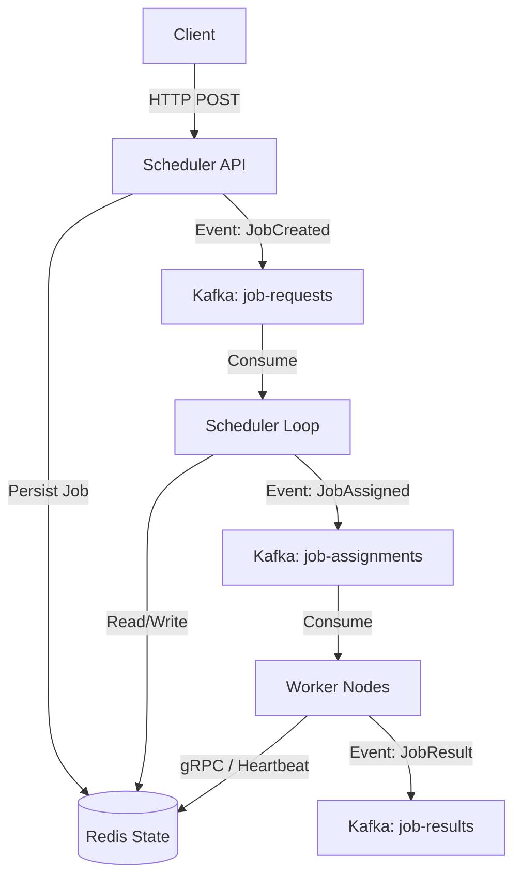

# Distributed Job Scheduler (At Scale)


> **Summary:** A Kafka-driven, fault-tolerant distributed job scheduler featuring leader-based scheduling, worker heartbeats, exponential backoff retries, and Redis-backed state management.

## 1. Project Overview

This system is designed to execute tasks across multiple worker nodes reliably, handling failures and scaling horizontally. It moves jobs through a strict lifecycle:
`PENDING` → `SCHEDULED` → `RUNNING` → `SUCCESS` | `FAILED`

### Core Features
* **Distributed Architecture:** Decoupled Scheduler, API, and Workers using Kafka.
* **Fault Tolerance:** Automatic recovery from worker crashes via heartbeat monitoring.
* **At-Least-Once Delivery:** Ensures tasks are never lost, even during network partitions.
* **Leader Election:** Ensures only one Scheduler assigns tasks to prevent duplicates.
* **Hybrid Communication:** HTTP (FastAPI) for external clients, gRPC/Kafka for internal high-performance signaling.

---

## 2. System Architecture

The system uses a **Producer-Consumer** pattern with **Redis** as the single source of truth for job state.



### Component Breakdown

| Component | Responsibility |
| :--- | :--- |
| **Scheduler API** | Accepts jobs via HTTP, validates input, persists initial state to Redis, and publishes `job-requests`. |
| **Scheduler Loop** | The "Brain." Consumes requests, assigns jobs to available workers, handles retries, and manages Leader Election. |
| **Workers** | The "Muscle." Consumes assignments, executes tasks, reports results, and sends periodic **heartbeats** to Redis. |
| **Redis** | Authoritative state for Job Lifecycle, Worker Health, and Distributed Locks. |
| **Kafka** | Event backbone ensures decoupling and replayability (`job-requests`, `job-assignments`, `job-results`). |

## 3. Reliability & Fault Tolerance

This project prioritizes system stability under failure conditions:

* **Worker Crash Recovery:** If a worker stops sending heartbeats, the Scheduler detects the timeout and re-queues its running jobs.
* **Leader Election:** Prevents "Split Brain" scenarios where multiple schedulers try to assign the same job.
* **Idempotency:** Workers handle duplicate messages safely (e.g., if Kafka delivers a message twice).
* **Data Persistence:** Redis AOF (Append Only File) ensures job state survives system restarts.

### Failure Scenarios Handled
* **Worker crash mid-job:** $\rightarrow$ Detected via heartbeat loss; job is re-queued.
* **Scheduler crash:** $\rightarrow$ Standby scheduler takes over leader lock.
* **Network Partition:** $\rightarrow$ System favors consistency; updates sync once partition heals.

## 4. Data Models

### Job Schema
Stored in Redis and passed via API.
```json
{
  "job_id": "uuid-v4-string",
  "payload": {
    "task": "image_resize",
    "image_url": "s3://bucket/image.png"
  },
  "status": "PENDING",
  "assigned_worker": "worker-node-01",
  "retry_count": 0,
  "max_retries": 3,
  "created_at": "2025-12-31T10:00:00Z",
  "updated_at": "2025-12-31T10:00:05Z"
}
```

### Worker Schema
Used for heartbeats and liveness checks.

```json

{
  "worker_id": "worker-node-01",
  "status": "ALIVE",
  "last_heartbeat": "2025-12-31T10:05:00Z",
  "current_jobs": ["job_id_123", "job_id_456"]
}
```
### Kafka Events
The system relies on strict event types for communication:

JobCreated: Triggered when a client submits a request.
JobAssigned: Scheduler picks a worker.
JobStarted: Worker acknowledges receipt.
JobCompleted: Worker finishes successfully.
JobFailed: Execution error or timeout.
WorkerRegistered / WorkerDead: Lifecycle events for monitoring.

## 5. Reliability & Fault Tolerance

To ensure high availability and data integrity, the system implements several distributed systems patterns:

* **Leader Election:** Uses Redis atomic locks (`SETNX` with TTL) to ensure only **one** Scheduler instance runs the assignment loop at a time. If the leader crashes, the lock expires, and a standby scheduler automatically takes over.
* **At-Least-Once Execution:** Jobs are only marked `COMPLETED` after the worker explicitly acknowledges success. If a worker fails or disconnects before completion, the job is eventually re-delivered.
* **Worker Crash Recovery (Heartbeats):** Workers send a "pulse" to Redis every 5 seconds. The Scheduler monitors the `last_heartbeat` timestamp. If a worker is silent for >30 seconds, it is marked `DEAD`, and its `RUNNING` jobs are reset to `PENDING` for reassignment.
* **Kafka Replay:** All state changes are persisted as events in Kafka. In the event of a catastrophic database failure, the system can rebuild the job state by replaying the event stream.


## 6. Failure Scenarios

| Scenario | System Response |
| :--- | :--- |
| **Duplicate Kafka Message** | Workers check the job status in Redis before execution. If already processed, the duplicate message is discarded (Idempotency). |
| **Worker Crash Mid-Job** | Scheduler detects missed heartbeat $\rightarrow$ Marks worker `DEAD` $\rightarrow$ Re-queues running jobs to `PENDING`. |
| **Scheduler Crash** | The Redis Leader Lock expires. A standby scheduler instance acquires the lock and resumes processing immediately. |
| **Redis Unavailable** | API rejects new submissions (503 Service Unavailable) to prevent data loss. Kafka buffers read events until the store comes back online. |
| **Network Partition** | The system favors **Consistency** over Availability (CP). Updates pause until the partition heals to avoid "Split Brain" (multiple schedulers assigning the same job). |


## 7. Optional Enhancements / Roadmap

* [ ] **Metrics Collection:** Integrate Prometheus/Grafana to visualize queue depth, job latency, and worker throughput.
* [ ] **Job Timeouts:** Implement a watchdog to cancel jobs that stay in `RUNNING` state longer than a defined threshold (e.g., 10 minutes).
* [ ] **Exponential Backoff:** Implement progressive delays (1s, 2s, 4s, 8s) for retrying failed jobs to prevent "thundering herd" issues on downstream services.
* [ ] **Smart Scheduling:** Replace random worker assignment with a "Least Loaded" strategy (routing jobs to the worker with the fewest active tasks).
